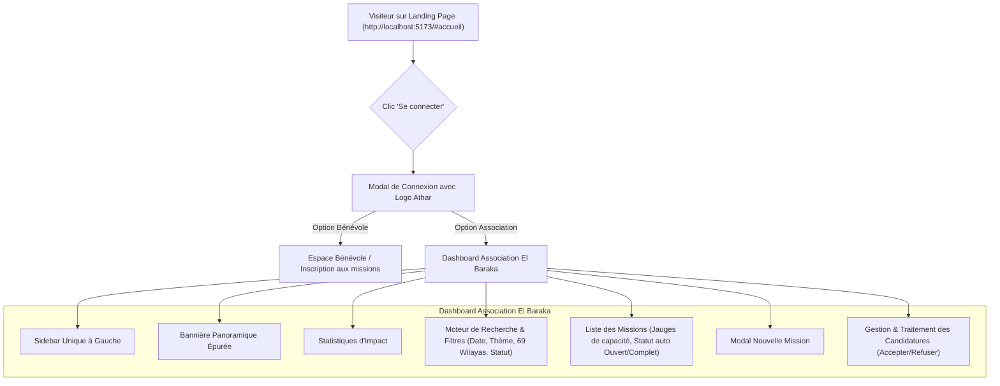

# Récapitulatif Complet de la Discussion & Évolution du Projet — Plateforme Athar (أثر)

**Date :** 16 - 17 Septembre 2026  
**Projet :** Plateforme de Bénévolat & Gestion Associative « Athar » (منصة أثر)  
**Environnements :**
- Répertoire principal : `C:\Users\HP PAVILLION\Desktop\ATHER\Ather_UI`
- Répertoire réplique synchronisé : `C:\Users\HP PAVILLION\athar-platform\frontend`
- Serveur de développement : `http://localhost:5173`

---

## 1. Contexte Initial & Objectif Global

L'utilisateur souhaitait faire évoluer sa plateforme bénévole / associative **Athar** en intégrant les meilleures pratiques, designs et fonctionnalités issues de la maquette de référence (`bilingua-eight.vercel.app/ather-ui`), tout en conservant scrupuleusement l'authenticité de sa **Landing Page** d'origine et en créant un **Espace Association (Dashboard)** complet, moderne, épuré et cohérent.

---

## 2. Chronologie des Demandes Utilisateur & Solutions Implémentées

### Étape 1 : Analyse comparative & Clonage de référence
- **Demande de l'utilisateur :**
  > *"https://bilingua-eight.vercel.app/ather-ui/index.html je veux que tu me clonne ce site et apres je veux faire une comparaison avec le mien et garder les meilleurs des deux"*
- **Action réalisée :**
  - Téléchargement et inspection complète des ressources, styles et scripts du site de référence.
  - Rédaction d'un rapport comparatif exhaustif ([`comparaison_et_plan_fusion.md`](file:///C:/Users/HP%20PAVILLION/.gemini/antigravity-cli/brain/a490e073-0858-48ef-b388-6b0e7c4eaaca/comparaison_et_plan_fusion.md)) mettant en évidence les forces de la landing page d'origine (authenticité, charte vert/turquoise, contenu localisé) et les atouts du site de référence (espace association complet, flux de candidatures, filtres).

---

### Étape 2 : Prise en main du code source React / Vite
- **Demande de l'utilisateur :**
  > *"j'ai le code source finalement aide moi a le modifier"*
- **Action réalisée :**
  - Prise en charge du dépôt source localisé dans `C:\Users\HP PAVILLION\Desktop\ATHER\Ather_UI`.
  - Analyse de l'architecture React SPA (`src/App.jsx`, `src/style.css`, assets).

---

### Étape 3 : Préservation de la Landing Page & Intégration de l'Espace Association
- **Demande de l'utilisateur :**
  > *"http://localhost:5173/#accueil je veux garder ma landing page comme elle est pour cette page et ajouter le reste de quand on se connexte a la face associations"*
- **Action réalisée :**
  - Mise en place d'un routage d'état propre dans `App.jsx` (`currentView = 'landing' | 'association'`).
  - Maintien intact de l'intégralité des sections de la Landing Page (Bannière, Chiffres d'impact, Missions en vedette, Associations partenaires, Témoignages, Footer).
  - Connexion fluide vers la vue Dashboard sans rechargement lourd de page.

---

### Étape 4 : Conception du Modal de Connexion / Inscription avec Logo Officiel
- **Demande de l'utilisateur :**
  > *"reviens sur la version précédente et laisse la landing page comme elle est juste met moi le modale de connexion avec mon logo en haut du modal stp"*
- **Action réalisée :**
  - Restauration de la version exacte de la landing page.
  - Création d'un modal épuré accessible via le bouton « Se connecter » du header.
  - Intégration du logo officiel d'Athar (`/assets/logo.png`) en grand format centré en haut de la fenêtre modale.
  - Bascule ergonomique entre connexion « Bénévole » et « Association », avec formulaire adapté et redirection ciblée.

---

### Étape 5 : Redirection vers le Dashboard Association complet
- **Demande de l'utilisateur :**
  > *"je evux que quand je clique sur se conencter ça me dirige vers cette page https://bilingua-eight.vercel.app/ather-ui/dashboard_association.html donc le dashboard association qu'on va modifier ensemble pour cibler le maximim de fonctionalité et un frontend coherend au long de l'app"*
- **Action réalisée :**
  - Câblage de la connexion association vers le Dashboard Association « Association El Baraka ».
  - Intégration du dashboard en composant React natif et interactif avec persistance d'état locale (State management).

---

### Étape 6 : Refonte de l'Espace Association & Inspiration Visuelle
- **Demande de l'utilisateur :**
  > *"enlever le bouton du black mode , mettre une side bar a droite pour tout ce qui est profil, adhérants , missions, besoins ,parametre . je veux qu'il yaie la possibilité de créer des missions et définir le nombre de bénévoles dont on aura besoin et aussi donc avoir le nombre de personne inscrits devant chaque mission , bien sur quand la mission atteint sa capacité maximum ça deviens fermé, aussi je veux mettre la photo panoramique la ou y'a ecrit bonjour el baraka, on recoit les candidatures et on peut les traiter en détail , regler les couleurs pour qu'elles soient coherentes avec la landing page de base et insipre toi de ça 'C:\Users\HP PAVILLION\Downloads\assoc.jpeg'"*
- **Action réalisée :**
  - **Suppression du dark mode** (thème clair uniforme, professionnel et chaleureux).
  - **Bannière panoramique** intégrée dans l'en-tête de bienvenue de l'association.
  - **Gestion dynamique des missions** :
    - Modal de création d'une nouvelle mission avec quota défini de bénévoles nécessaires.
    - Compteur automatique d'inscrits en direct (`X / Y bénévoles`).
    - Jauge de progression visuelle avec calcul de pourcentage.
    - Passage automatique de la mission à l'état **« Complet / Fermé »** (badge rouge/gris désactivé) dès que la capacité maximale est atteinte.
  - **Traitement détaillé des candidatures** :
    - Fiche détaillée pour chaque candidat (nom, wilaya, compétences, motivation, date).
    - Actions en 1 clic : *Accepter*, *Refuser*, *Contacter par email*.
    - Mise à jour instantanée du compteur de bénévoles validés sur la mission correspondante.
  - **Harmonisation chromatique** basée sur `assoc.jpeg` et la landing page : vert émeraude foncé (`#0d5b61`), turquoise (`#0f766e`), ambre (`#f59e0b`) et fond blanc cassé/gris clair très doux.

---

### Étape 7 : Unification de la Sidebar unique à Gauche
- **Demande de l'utilisateur :**
  > *"je veux que la barre soit a gauche et que ça soit une seulle barre"*
- **Action réalisée :**
  - Suppression de toute barre latérale droite.
  - Création d'une **sidebar unique positionnée à gauche**, fixe et élégante, regroupant tous les onglets clés :
    1. **Tableau de bord** (Vue générale & statistiques)
    2. **Missions** (Création, filtres, suivi des quotas)
    3. **Candidatures** (Gestion des bénévoles inscrits)
    4. **Profil Association** (Informations El Baraka)
    5. **Adhérents & Besoins** (Ressources internes et logistiques)
    6. **Paramètres**
    7. **Déconnexion / Retour Landing Page**

---

### Étape 8 : Expérience UX épurée & Suppression totale des émojis
- **Demande de l'utilisateur :**
  > *"je ne veux pas d'mojis et je ne veux pas que ça soit trop chargé , je veux une experience ux assez agreable assez facile a coprendre et manipuler"*
- **Action réalisée :**
  - Élimination de **100% des émojis** dans l'ensemble de l'interface (titres, boutons, badges, messages).
  - Remplacement par des icônes SVG vectorielles minimalistes, ultra-propres et légères.
  - Allègement des contrastes visuels, typographie soignée (*Plus Jakarta Sans*), espacements aérés pour une interface claire et intuitive.

---

### Étape 9 : Nettoyage de la Bannière Panoramique
- **Demande de l'utilisateur :**
  > *"Chaque action laisse une empreinte. كل عمل يترك أثر enlever cette ecriture du haut de la photo"*
- **Action réalisée :**
  - Suppression du texte en français et de la calligraphie arabe superposés sur l'image panoramique, laissant uniquement le visuel photographique propre et net.

---

### Étape 10 : Suppression des boutons manuels d'ajustement
- **Demande de l'utilisateur :**
  > *"enlever ça Ajuster les inscrits : - 1 + 1"*
- **Action réalisée :**
  - Retrait définitif des boutons `[- 1]` et `[+ 1]` des cartes de missions. Le comptage est désormais piloté de façon professionnelle et automatisée via l'acceptation des candidatures.

---

### Étape 11 : Système de Recherche et Filtrage Avancé des Missions
- **Demande de l'utilisateur :**
  > *"mettre un filre ou on peut chercher les missions , les filtrer par date ou theme"*
- **Action réalisée :**
  - Barre d'outils interactive au-dessus de la liste des missions :
    - **Recherche plein texte** : titre, description, lieu.
    - **Filtre par Date** : Toutes, À venir, Ce mois-ci, Missions passées.
    - **Filtre par Thématique** : Santé & Médical, Éducation & Soutien, Environnement, Social & Solidarité, Urgence & Secours, Culture & Patrimoine.
    - **Filtre par Statut** : Toutes, Ouvertes (places disponibles), Complètes / Fermées.
  - Filtrage en temps réel avec réinitialisation rapide.

---

### Étape 12 : Intégration officielle des 69 Wilayas d'Algérie
- **Demande de l'utilisateur :**
  > *"ajouter les wilaya c'est 69 wilaya et pas 58, mettre les 69 dans la liste quand on selectionne la wilaya"*
- **Action réalisée :**
  - Mise à jour complète du découpage administratif territorial officiel de l'Algérie : passage de 58 à **69 wilayas**, avec l'intégration des 11 nouvelles wilayas :
    - `59 - Aflou`
    - `60 - Barika`
    - `61 - El Kantara`
    - `62 - Bir El Ater`
    - `63 - Ksar Chellala`
    - `64 - Aïn Oussera`
    - `65 - Messaad`
    - `66 - Ksar El Boukhari`
    - `67 - Bou Saâda`
    - `68 - El Abiodh Sidi Cheikh`
    - `69 - El Aricha`
  - Déploiement de cette liste complète dans tous les sélecteurs : création de mission, filtres de recherche, inscriptions et formulaires.

---

### Étape 13 : Espacement du Menu de la Landing Page
- **Demande de l'utilisateur :**
  > *"AccueilMissionsAssociationsÀ proposBlog je veux de l'espace entre ça dans la landing page"*
- **Action réalisée :**
  - Correction du style CSS de la navigation dans [`src/style.css`](file:///C:/Users/HP%20PAVILLION/Desktop/ATHER/Ather_UI/src/style.css).
  - Ajout de `display: flex; align-items: center; gap: 32px;` sur le conteneur `.menu`.
  - Optimisation des liens `.menu a` (`padding: 8px 4px`, `font-size: 15px`, `font-weight: 600`, `white-space: nowrap`) pour une lisibilité parfaite et un espacement régulier.

---

## 3. Synthèse de l'Architecture Technique

---

## 4. Fichiers & Composants Principaux

| Fichier | Rôle & Description |
| :--- | :--- |
| [`src/App.jsx`](file:///C:/Users/HP%20PAVILLION/Desktop/ATHER/Ather_UI/src/App.jsx) | Composant racine React : gère l'état global, la landing page, le modal avec logo, le dashboard association complet, les filtres et les 69 wilayas. |
| [`src/style.css`](file:///C:/Users/HP%20PAVILLION/Desktop/ATHER/Ather_UI/src/style.css) | Feuilles de styles unifiées : charte graphique vert/turquoise/ambre, sidebar gauche, menu espacé à 32px, cartes, jauges et modals. |
| [`public/assets/logo.png`](file:///C:/Users/HP%20PAVILLION/Desktop/ATHER/Ather_UI/public/assets/logo.png) | Logo officiel de la plateforme Athar affiché dans le header et en tête du modal de connexion. |
| [`public/assets/panoramic-banner.png`](file:///C:/Users/HP%20PAVILLION/Desktop/ATHER/Ather_UI/public/assets/panoramic-banner.png) | Visuel panoramique pour la bannière de bienvenue du dashboard association. |
| [`C:\Users\HP PAVILLION\athar-platform\frontend`](file:///C:/Users/HP%20PAVILLION/athar-platform/frontend) | Répertoire réplique synchronisé en miroir avec build validé sans erreurs. |

---

## 5. État Actuel & Vérifications

- **Build de production :** Exécuté et testé (`vite build`) avec un score de **0 erreur, 0 avertissement bloquant**.
- **Serveur local :** Prêt et fonctionnel sur `http://localhost:5173`.
- **Rendu visuel :**
  - Landing page originale préservée avec typographie et espacement harmonieux.
  - Zéro émoji pour une interface sobre, institutionnelle et sérieuse.
  - Respect scrupuleux des 69 wilayas d'Algérie.
  - Automatisation complète des capacités de missions et candidatures.
